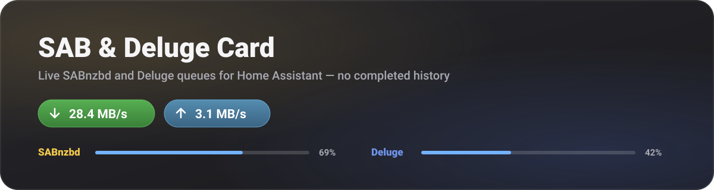

# SAB & Deluge Card



A focused Home Assistant Lovelace card for live SABnzbd and Deluge download
queues. It keeps the visual style and useful controls of Arr Stack Card while
removing the completed-history clutter.

> The banner above is an illustration of the card's layout, not a screenshot.

## What this card does differently

- Shows the combined SABnzbd and Deluge download speed
- Shows Deluge upload speed
- Displays only SABnzbd's current queue and never requests SAB history
- Displays only incomplete Deluge torrents, including downloading, queued,
  checking, paused, and errored items
- Hides completed and seeding Deluge torrents without deleting them
- Pauses or resumes each client from the card
- Pauses, resumes, or removes individual Deluge queue items
- Removes current SABnzbd queue items
- Uses the Deluge action names and `id` field expected by Arr Stack Integration
- Includes pagination, progress/speed sorting, responsive mobile layout, and a
  visual card editor

## Requirements

1. Home Assistant 2024.6 or newer
2. HACS
3. [Arr Stack Integration](https://github.com/martinargalas/arr-stack-integration)
4. SABnzbd and/or Deluge configured in Arr Stack Integration

The card does not store API keys and does not connect directly to either
download client. All requests go through Home Assistant's authenticated
`arr_stack` API.

## Install with HACS

1. Open **HACS**
2. Open the three-dot menu and choose **Custom repositories**
3. Add `https://github.com/Tmatz27/ha-sab-deluge-card`
4. Choose the **Dashboard** category
5. Install **SAB & Deluge Card**
6. Refresh the browser

## Add the card

Use the dashboard visual editor and choose **SAB & Deluge Card**, or add:

```yaml
type: custom:sab-deluge-card
```

## The card is not in the "Add card" list

Work through these in order. Step 1 tells you which half of the problem you have.

**1. Did the file load?** Open the browser console (F12 → Console) on a
dashboard page and look for the version banner:

```
SAB & Deluge Card v0.1.1
```

- **Banner present** → the card is registered. Skip to step 4.
- **Banner missing** → the browser never ran the file. Continue with step 2.

**2. Is the resource registered?** Go to **Settings → Dashboards → ⋮ (top
right) → Resources**. You need an entry of type **JavaScript Module**:

```
/hacsfiles/ha-sab-deluge-card/sab-deluge-card.js
```

If it is missing, add it with **+ Add Resource** using exactly that URL and the
**JavaScript Module** type. HACS adds this automatically only for
storage-mode dashboards.

**3. Running Lovelace in YAML mode?** HACS cannot register the resource for
you. Add it to `configuration.yaml` and restart:

```yaml
lovelace:
  mode: yaml
  resources:
    - url: /hacsfiles/ha-sab-deluge-card/sab-deluge-card.js
      type: module
```

**4. Clear the frontend cache.** The dashboard caches resources aggressively:

- Desktop: hard refresh with `Ctrl+Shift+R` (`Cmd+Shift+R` on macOS)
- Mobile app: **Settings → Companion App → Debugging → Reset frontend cache**,
  then fully close and reopen the app

**5. Search rather than scroll.** In the card picker, type `SAB` in the search
box. Custom cards are grouped near the bottom of the list, below every built-in
card, so they are easy to miss when scrolling.

If the console shows an error mentioning `sab-deluge-card` instead of the
version banner, please open an issue with that message.

## Configuration

Every setting is available in the visual editor.

```yaml
type: custom:sab-deluge-card
show_total_speed: true
show_sabnzbd: true
show_deluge: true
show_upload_speed: true
allow_controls: true
items_per_page: 3
refresh_interval: 10
application_icons: real
```

| Option | Default | Description |
| --- | ---: | --- |
| `show_total_speed` | `true` | Show the combined speed panel |
| `show_sabnzbd` | `true` | Show the SABnzbd section |
| `show_deluge` | `true` | Show the Deluge section |
| `show_upload_speed` | `true` | Show Deluge's total upload speed |
| `allow_controls` | `true` | Show pause, resume, and removal controls |
| `items_per_page` | `3` | Queue items per client page, from 1 to 10 |
| `refresh_interval` | `10` | Refresh interval in seconds, from 5 to 300 |
| `application_icons` | `real` | `real` client logos or `mdi` icons |

## Queue behavior

SABnzbd's `/queue` endpoint is the only SAB download-list endpoint used. The
card never calls `/history`, so completed and failed history cannot accumulate
in the dashboard.

Deluge does not return a separate queue and history through this integration.
Its queue endpoint returns every torrent known to the daemon. This card filters
that response to `progress < 100`, which keeps current incomplete work visible
and hides completed or seeding torrents.

Hidden Deluge torrents remain in Deluge. The filter does not remove files,
change ratios, or alter Deluge's own queue.

## Removal controls

- SABnzbd removal affects only the current queue item.
- Deluge's magnet button removes the torrent while keeping downloaded files.
- Deluge's trash button removes the torrent and deletes downloaded files.

Both removal flows require an extra confirmation click.

## Privacy and security

- **No credentials in the card.** SABnzbd and Deluge secrets stay in Arr Stack
  Integration's config entry. Every request goes to Home Assistant's own
  authenticated `/api/arr_stack/...` proxy, which is served with
  `requires_auth = True`.
- **No telemetry.** The card sends no analytics and contacts no third party
  other than the icon CDN below.
- **One external request.** With `application_icons: real`, the two client
  logos are fetched from `cdn.jsdelivr.net`. They are requested with
  `referrerpolicy="no-referrer"`, so your Home Assistant URL is not sent, but
  the request still reveals your IP address to the CDN. Set
  `application_icons: mdi` to make the card fully self-contained with no
  outbound requests.
- **Download and torrent names are escaped** before rendering, so a crafted
  release name cannot inject markup into the dashboard.
- **No inline event handlers**, which keeps the card compatible with strict
  Content-Security-Policy setups.
- **Both removal actions require a second click** to confirm. Removing a
  torrent with the trash button deletes its files on disk and cannot be undone.

## Development

```bash
npm test
```

No build step is required. `sab-deluge-card.js` is the HACS release file.

## Credits

The visual design and interaction patterns are based on
[Arr Stack Card](https://github.com/martinargalas/ha-arr-stack-card) by
martinargalas. Data is provided by
[Arr Stack Integration](https://github.com/martinargalas/arr-stack-integration).
Both upstream projects are licensed under the MIT License.

## License

MIT
